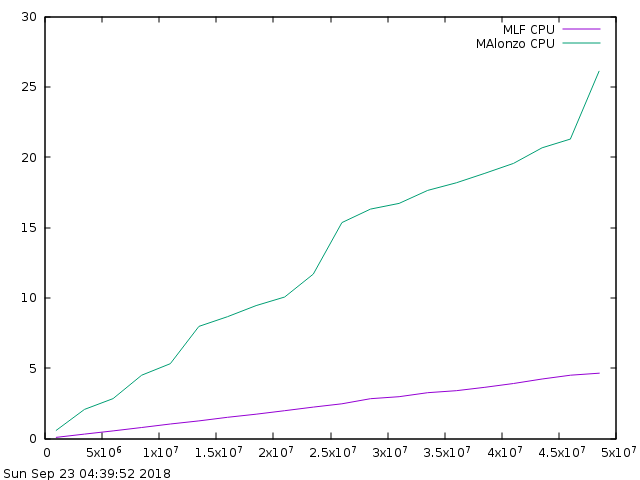
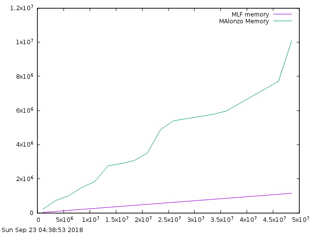

[](https://travis-ci.org/xekoukou/agda-ocaml)


## Introduction

This is an experimental back end for Agda that targets the OCaml compiler.


## Requirements


```OCaml 4.0.7.0+flambda``` can be installed with ```opam```

```
opam switch create 4.0.7.0+flambda
opam switch 4.0.7.0+flambda
```

opam packages:
```
malfunction.0.3 zarith-freestanding uutf uunf uucp lwt
```

The ```stack``` package manager is also required to perform the installation.

## Building

    ln -s stack-*.yaml stack.yaml
    stack build

## Installing

    stack install agda-ocaml

## Testing

    make
    make compiler-test

## Initial Benchmark Results


<p style="text-align: center;">
 
 
</p>


## Limitations

  Currently , there is no support for float types or the reflection primitives.
  For float types, this is intentional, since anyone could use the FFI to perform computations on float types.

  The ```PSeq``` primitive is not respected. The evaluation order could be different.

## Important Notice

Currently, I have tried to match the string(unicode) implementation of haskell as much as possible. There might be differences though which means that
even though one could show string equality during typechecking, this might not be the case during execution. For this reason, the string primitives should not be used in critical parts
of your code.

## Usage

### CommandLine

Compiling a program :

```
agda-ocaml --mlf mainFile.agda
```

Creating an OCaml library :

```
agda-ocaml --mlf --cmx File.agda
```


### Pragmas

This backend has the same internal representation as OCaml itself. This means that all OCaml algebraic data types can be easily expressed in Agda.
The important thing to remember is that the order of the agda constructors must follow the order of the OCaml type.
Also , the arity of the constructors must be the same as the OCaml type.


ex:

```agda

module ll where


open import Agda.Builtin.Unit public renaming (⊤ to Unit; tt to unit)
open import Agda.Builtin.IO public
open import Agda.Builtin.Nat public
  using    ( Nat; zero; suc)


open import Agda.Builtin.Int public renaming (Int to Integer)
open import Agda.Builtin.String public

intToString : Integer → String
intToString = primShowInteger

showN : Nat -> String
showN n = intToString (pos n)


postulate
  return  : ∀ {a} {A : Set a} → A → IO A
  _>>=_   : ∀ {a b} {A : Set a} {B : Set b} → IO A → (A → IO B) → IO B

{-# FOREIGN OCaml
  let ioReturn _ _ x world = Lwt.return x
  let ioBind _ _ _ _ x f world = Lwt.bind (x world) (fun x -> f x world)
#-}

{-# COMPILE OCaml return = ioReturn #-}
{-# COMPILE OCaml _>>=_ = ioBind #-}

postulate
  putStr     : String -> IO Unit

{-# FOREIGN OCaml 
  let printString y world = Lwt.return (print_string y)
#-}

{-# COMPILE OCaml putStr = printString #-}

putStrLn   : String -> IO Unit
putStrLn s = putStr s >>= \_ -> putStr "\n"


{-# FOREIGN OCaml

type foo =
  | Int of Z.t
  | Nothing
  | Pair of Z.t * Z.t
  | Boring;;

let fok = Int (Z.of_int 34)
let no = Nothing
let bo = Boring
let bol = Pair (Z.of_int 22 , Z.of_int 73)

#-}


data foo : Set where
  int : Nat → foo
  nothing : foo
  pair : Nat → Nat → foo
  boring : foo
  

postulate
  fok : foo
  bol : foo
  no  : foo
  bo  : foo

{-# COMPILE OCaml fok = fok #-}
{-# COMPILE OCaml bol = bol #-}
{-# COMPILE OCaml no = no #-}
{-# COMPILE OCaml bo = bo #-}


fun : foo -> String
fun (int x) = showN (suc x)
fun nothing = "nothing"
fun boring = "boring"
fun (pair x x₁) = showN x₁

main : IO Unit
main = 
  putStrLn (fun fok) >>= (\_ ->
  putStrLn (fun bol) >>= (\_ ->
  putStrLn (fun no) >>= (\_ ->
  putStrLn (fun bo))))


```

### IO translation

Currently , to avoid having ```IO``` be executed at the point of definition, a ```world``` argument is passed
to all functions that return ```IO A``` and it is applied to the result of that function.

I am personally going to use the lwt library for IO as can be seen in the previous example.

### Exporting To OCaml

To export a function or data to OCaml, you use the export pragma.
You need to specify the OCaml type this function translates into.

ex. :

```agda

module BB where

open import Agda.Builtin.String public


str : String
str = "Hello from Agda."


{-# COMPILE OCaml str as val str : string #-}
```
then execute :

```
agda-ocaml --mlf --cmx BB.agda
```
A cmx file is created , called ```BB.cmx``` as well as ```ForeignCode.cmx``` , for the code that is imported into Agda.

To access ```str``` from OCaml file ```s.ml``` :

```OCaml
let () = print_string BB.str
```

then you compile both in the familiar way :

```
ocamlfind ocamlopt -thread -linkpkg -package zarith,uunf,uunf.string,uutf,uucp,lwt ForeignCode.cmx BB.cmx s.ml
```

[malfunction]: https://github.com/stedolan/malfunction
